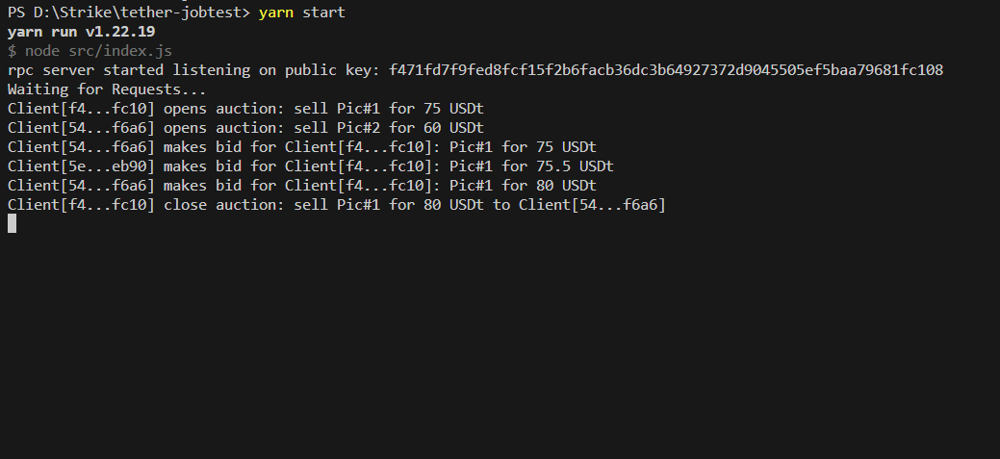
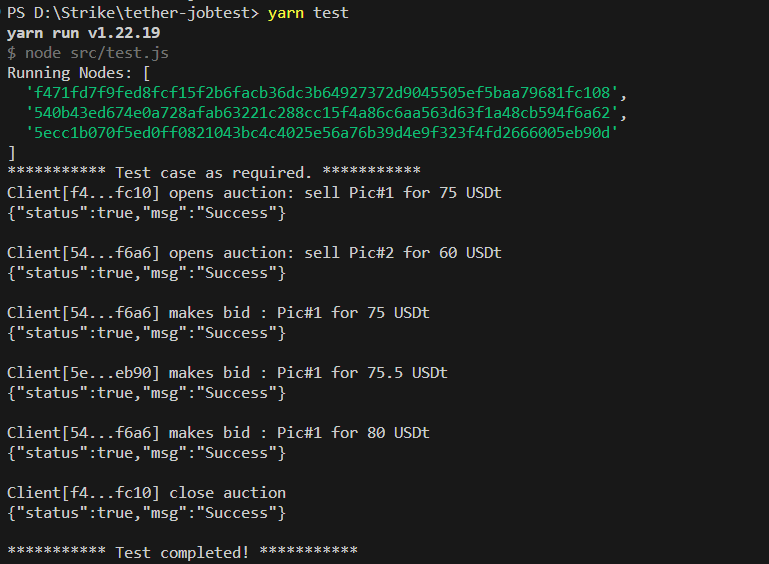

# Node Test for Tether
Simplified P2P auction solution based on Hyperswarm RPC and Hypercores.

## Quick Start
### 1. Run a local DHT Network
- Terminal #1 > `hyperdht --bootstrap --host 127.0.0.1 --port 30001`

### 2. Run 3 Servers for 3 Clients
- Terminal #2 > `yarn start`

- Terminal #3 > `yarn start`

- Terminal #4 > `yarn start`

### 3. Run Test scripts
- Terminal #5 > `yarn test`

## Description
You need to run a server for each client.

Each server will log all messages from the network, you can check them on each Terminal.

Client ID will be identified with `pubkey` of the server.

To have a full Test, at least 3 servers are running on the network.

Currently, using HBee for db to store keys of the running servers.

_( Tried to use `lookup()` function of `DHT` to get online nodes, but failed )_

## Screenshot for Test

## To do list
- Implement multi-auctions, currently can't open auction if already have opened auction
- Add balance for each clients and validate funds for each actions 